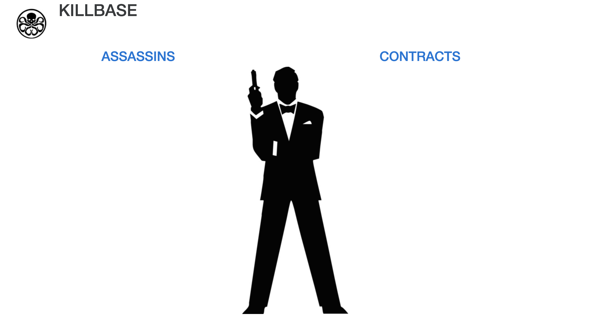
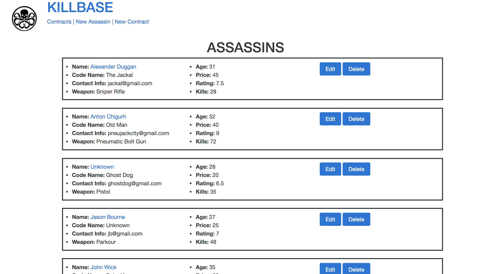
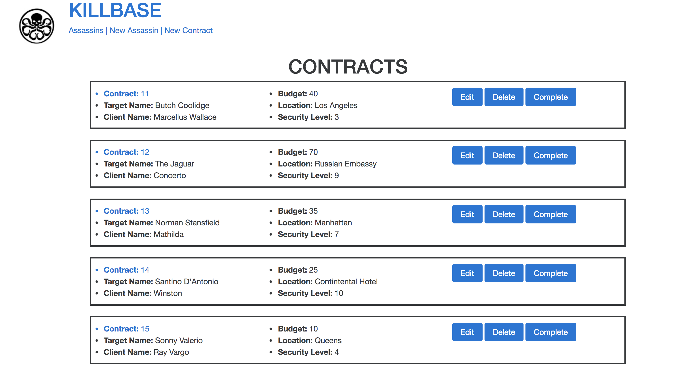
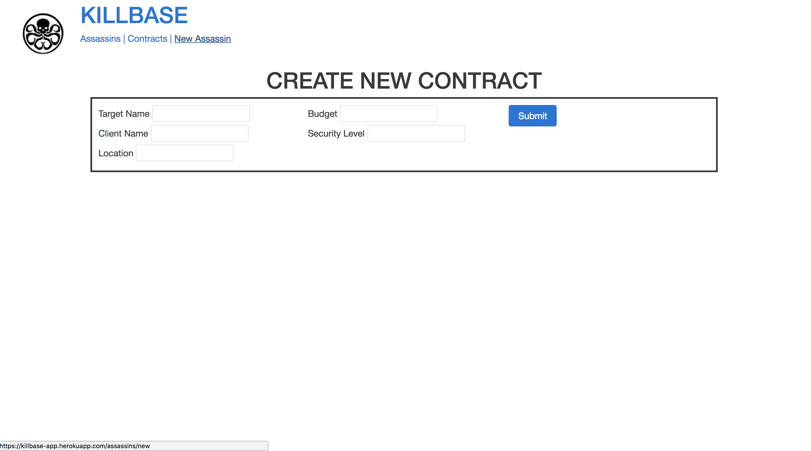

# Killbase

An exercise on how to build a backend application with PostgreSQL, Knex, Express and connect that to a frontend application built with EJS, HTMl and Javascript.

# Build-Tools

<li>PostgreSQL</li>
<li>Express</li>
<li>Knex</li>
<li>EJS</li>
<li>jQuery/ Javscript</li>
<li>HTML</li>
<li>CSS</li>
<li>Bootstrap</li>

